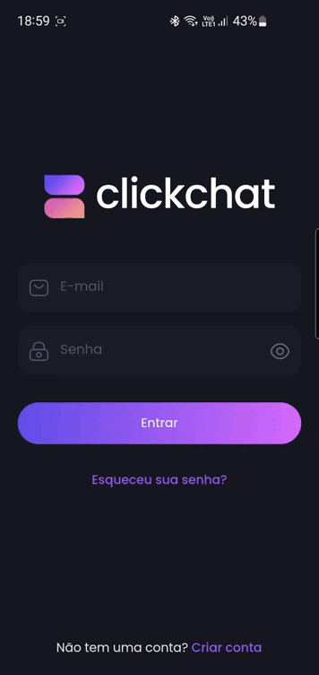
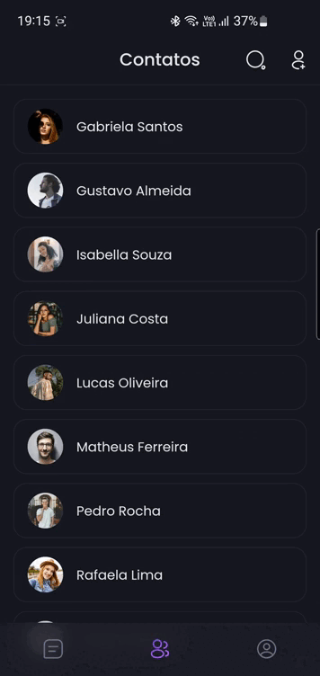

<div style="height: 20px"></div>

Aplicativo de chat mobile desenvolvido com Flutter e Firebase.

## 🎯 Funcionalidades
- `Autenticação`
  - Criar uma conta para entrar no aplicativo
- `Conversas`
  - Listar conversas
  - Enviar mensagens para os contatos e receber
  - Remover mensagens apenas para um usuário
  - Apagar conversas
- `Contatos`
  - Listar contatos
  - Adicionar, remover e editar um contato
- `Perfil`
  - Tirar, selecionar e remover uma foto para o perfil
  - Sair da conta
- `Notificações`
  - Receber e enviar notificações de mensagens

## 📱 Demo
<div style="display: flex;">
<div style="background-image: linear-gradient(#604ee8 , #d66afc); padding: 5%; width: 50%; text-align: center; border-radius: 5px;">
  
</div>
<div style="width: 10px"></div>
<div style="background-image: linear-gradient(#604ee8 , #d66afc); padding: 5%; width: 50%; text-align: center; border-radius: 5px;">
  
</div>
</div> 

<div style="height: 10px"></div>

<div style="display: flex;">
<div style="background-image: linear-gradient(#d66afc , #604ee8); padding: 5%; width: 50%; text-align: center; border-radius: 5px;">
  
</div>
<div style="width: 10px"></div>
<div style="background-image: linear-gradient(#d66afc , #604ee8); padding: 5%; width: 50%; text-align: center; border-radius: 5px;">
  
</div>
</div> 

## 🗺️ Arquitetura
- **Repository Pattern:** Para acesso a API externa
- **Dependency Injection:** Resolver dependências das classes (Provider)
- **Controllers:** Guardar e mudar estados (ValueNotifier)
- **Stores:** Guardar e mudar estados (Foi utilizado apenas na feature auth para exemplo)
- **Usecases:** Regras de negócio
- **Push Notification:** (Firebase Cloud Messaging)
- **Tests**

## 📦 Pacotes/Dependências
- [iconsax](https://pub.dev/packages/iconsax)
- [provider](https://pub.dev/packages/provider)
- [http](https://pub.dev/packages/http)
- [flutter_local_notifications](https://pub.dev/packages/flutter_local_notifications)
- [image_picker](https://pub.dev/packages/image_picker)
- [emoji_picker_flutter](https://pub.dev/packages/emoji_picker_flutter)
- [intl](https://pub.dev/packages/intl)
- [cached_network_image](https://pub.dev/packages/cached_network_image)
- [firebase_core](https://pub.dev/packages/firebase_core)
- [firebase_auth](https://pub.dev/packages/firebase_auth)
- [cloud_firestore](https://pub.dev/packages/cloud_firestore)
- [firebase_messaging](https://pub.dev/packages/firebase_messaging)
- [firebase_storage](https://pub.dev/packages/firebase_storage)

**dev:**
- [mocktail](https://pub.dev/packages/mocktail)
- [fake_cloud_firestore](https://pub.dev/packages/fake_cloud_firestore)

## 🧭 Instruções de Uso
Para usar o app, siga estas etapas:

Clone este repositório:
```bash
git clone https://github.com/mguilhermeneves/clickchat_app.git
```
Instale as dependências
```bash
flutter pub get
```

Configure o Firebase seguindo estas etapas.

1. Crie um projeto no [Firebase](https://console.firebase.google.com/).

2. Configure o Firebase no app seguindo as [instruções aqui](https://console.firebase.google.com/).

3. Dentro do projeto no Firebase, vai ser utilizado o Authentication, Cloud Firestore, Messasing e Storage.

4. Crie uma pasta chamada `pictures` no Firebase Storage.

Após configurar o Firebase no app, crie um arquivo `cloud_messasing_constant.dart` em ***lib/src/global/constants*** e adicione o seguinte código:
```dart
class CloudMessasingConstant {
  // Esse token está nas Configurações do projeto do Firebase, em 
  // Cloud Messasing (API Cloud Messaging (legada)).
  static const String token = 'CLOUD_MESSASING_TOKEN';
}
```

Execute o aplicativo:
```terminal
flutter pub run
```

## 📢 Aviso

Este projeto foi desenvolvido apenas para fins de diversão e para aprimorar minhas habilidades. Não é adequado para uso em produção ou para fins comerciais.

Se você tiver alguma dúvida ou sugestão, sinta-se à vontade para entrar em contato.

Divirta-se explorando o código!
